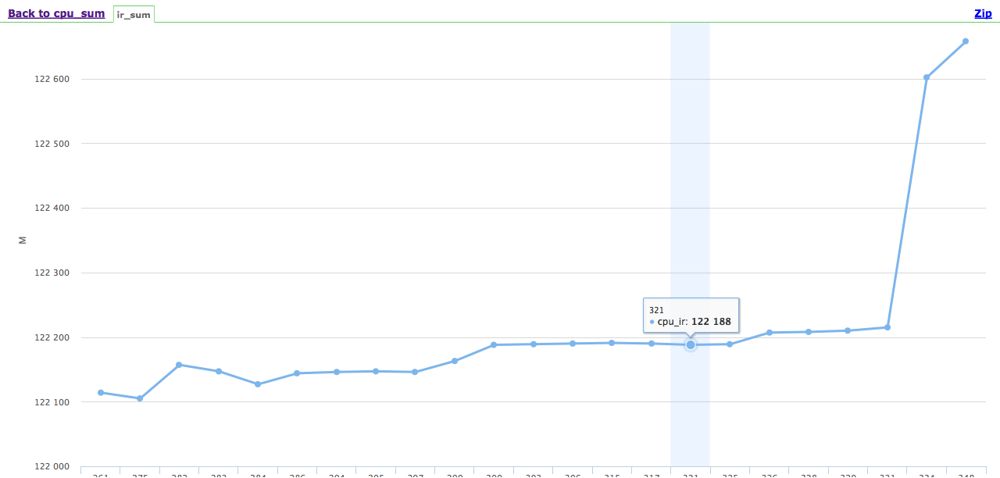

- [性能测试工具选择](#sec-1)
  - [Google perftools](#sec-1-1)
  - [Gprof](#sec-1-2)
  - [Oprofile](#sec-1-3)
  - [Valgrind](#sec-1-4)
    - [安装](#sec-1-4-1)
    - [使用方法](#sec-1-4-2)
    - [结果呈现](#sec-1-4-3)
    - [Kcachegrind](#sec-1-4-4)
- [模块性能ci](#sec-2)
  - [数据选型](#sec-2-1)
    - [时间](#sec-2-1-1)
    - [指令](#sec-2-1-2)
    - [采样](#sec-2-1-3)
    - [Cache-Miss](#sec-2-1-4)
    - [总结](#sec-2-1-5)
  - [用例设计](#sec-2-2)
    - [可重复性](#sec-2-2-1)
    - [职责单一](#sec-2-2-2)
    - [排除干扰因素](#sec-2-2-3)
    - [模拟性能环境](#sec-2-2-4)
  - [部署](#sec-2-3)
- [总结](#sec-3)

众所周知性能优化和设计是不可同时进行的，往往会顾此失彼，最好采用tick－tock的节奏。那么当真正需要性能优化时，绝对不可能凭空想象的去做，常见的做法就是使用性能测试工具测试出热点函数，针对热点函数做相应的优化。这针对小规模的软件当然无可厚非，但当项目规模巨大时，往往你所负责的性能优化时针对某一个模块的性能优化。那么这时你在茫茫大海中想捞出你所在模块的性能热点，可谓困难重重。这时你最希望有一个模块级别的性能ci，来帮助你纪录下开发中性能的变化趋势，以便有的放矢的去进行性能优化。

# 性能测试工具选择<a id="orgheadline9"></a>

性能优化的过程中尝试了如下的工具

## Google perftools<a id="orgheadline1"></a>

又名gperftools, 提供了多种测试的方式，可以完整的测试程序从创建到完成，也可以通过在代码中调用开始结束的函数，来控制所监控的程序段性能，以采样的方式来进行性能统计。
<https://github.com/gperftools/gperftools>

## Gprof<a id="orgheadline2"></a>

GNU 自带，通过在编译和链接时增加编译选项-pg 来支持，会降低编译速度，原理就是给各个函数增加出入口的信息，在运行过程中会生成打点数据。也是采用采样的方式来实现，对次数的统计时比较准确的，但时间统计粒度较粗(0.01s)，需要样本执行次数较多。

## Oprofile<a id="orgheadline3"></a>

非常强大的linux内核性能工具，需要在内核共版本的工具来支持，可以统计性能基数以及cache-miss等，两种模式

1.  NMI模式: 利用处理器的performance counter功能, 指定counter的类型type和累进数量count。<sup><a id="fnr.1" class="footref" href="#fn.1">1</a></sup>
2.  Timer Interrupt模式: 在没有performance counter支持的情况下(例如Vmware虚拟机下), 可以利用时钟中断来采样. 这时候就没有performance counter的概念了. 或者可以当成近似的cpu时钟周期事件. 要使用timer interrupt模式, 需要在加载oprofile.ko模块的时候,传递”timer=1″参数. modprobe oprofile timer=1

关注系统性能使用Oprofile非常合适，而针对模块性能ci使用oprofile缺乏针对性。

## Valgrind<a id="orgheadline8"></a>

### 安装<a id="orgheadline4"></a>

```shell
sudo apt-get install valgrind
```

### 使用方法<a id="orgheadline5"></a>

```shell
valgrind --tool=callgrind yourExe yourOptions
```

此处举例使用callgirnd工具，当然也可以换其它工具例如：
虚拟机的方式实现，将目标程序跑在valgrind虚拟机上，通过截获目标程序对系统的访问来获取性能指标，涵盖了内存，cache，多线程，指令等几乎所有的数据。缺点就必须承担程序启动的开销。

### 结果呈现<a id="orgheadline6"></a>

```shell
callgrind_annotate callgrind.out.12891 >report
```

report内容

    --------------------------------------------------------------------------------
    Profile data file 'callgrind.out.12891' (creator: callgrind-3.11.0)
    --------------------------------------------------------------------------------
    I1 cache:
    D1 cache:
    LL cache:
    Timerange: Basic block 0 - 13739683
    Trigger: Program termination
    Profiled target:  ftest-pp/ft-pp (PID 12891, part 1)
    Events recorded:  Ir
    Events shown:     Ir
    Event sort order: Ir
    Thresholds:       99
    Include dirs:
    User annotated:
    Auto-annotation:  off
    
    --------------------------------------------------------------------------------
            Ir
    --------------------------------------------------------------------------------
    69,084,706  PROGRAM TOTALS
    
    --------------------------------------------------------------------------------
           Ir  file:function
    --------------------------------------------------------------------------------
    9,208,329  /build/glibc-tVsQx_/glibc-2.21/string/../sysdeps/i386/i686/multiarch/memset-sse2.S:__memset_sse2 [/lib/i386-linux-gnu/libc-2.21.so]
    2,498,238  /build/glibc-tVsQx_/glibc-2.21/string/../sysdeps/i386/i686/multiarch/memcpy-ssse3.S:__memcpy_ssse3 [/lib/i386-linux-gnu/libc-2.21.so]
    2,317,793  /home/zc/Asn1Per.c:PerDeConstrainedUnsigned [/home/zc/ftest-pp/ft-pp]
    2,214,268  /build/glibc-tVsQx_/glibc-2.21/malloc/malloc.c:_int_malloc [/lib/i386-linux-gnu/libc-2.21.so]
    1,834,800  /home/zc/Asn1Per.c:PerEnConstrainedUnsigned [/home/zc/ftest-pp/ft-pp]
    1,757,784  /home/zc/Asn1Per.c:PerDeConstrainedInteger [/home/zc/ftest-pp/ft-pp]
    1,449,600  /home/zc/Asn1Per.c:PerEnConstrainedInteger [/home/zc/ftest-pp/ft-pp]
    1,194,571  /build/glibc-tVsQx_/glibc-2.21/malloc/malloc.c:_int_free [/lib/i386-linux-gnu/libc-2.21.so]
      968,600  /home/zc/v3.4/Code_ftest-pp/src/ft/domain/brs/FakeBrs.cpp:ftesting::FakeBrs::fillBearSetupRsp(tagTrchIPBearSetupRsp&) const [/home/zc/ftest-pp/ft-pp]

### Kcachegrind<a id="orgheadline7"></a>

Kcachegrind(MacOS 下Qcachegrind),  kcachegrind能够将callgirnd，cachegrind数据可视化，提供完整的调用链和性能数据。可以通过源代码视图，直接对于分析c／c＋＋代码每行语句的指令开销。

```shell
sudo apt-get install kcachegrind
```

# 模块性能ci<a id="orgheadline22"></a>

## 数据选型<a id="orgheadline15"></a>

首先我们必须选择一个合适的度量数据，性能ci的测试结果必须具有一定的可度量性和稳定性，性能ci的诞生是为了我们能及时的发现性能劣化的点，如果本身性能ci基于的测试数据波动性比较大，那么不明显的性能变化将被淹没。常见的度量数据有：时间，指令数，采样，Cache-Miss。下面我们逐一分析：

### 时间<a id="orgheadline10"></a>

选取时间作为性能工具是有一定的局限性，多任务系统时间的间隔往往受到调度任务的影响比较严重，一个很明显的例子，相同代码运行10次，得到的消耗时间不尽相同。作为用户态的程序，难免会被抢占。当数据规模较大，长时间且多次平均，确实可以减少波动性的影响。但由于波动不可避免的存在，导致较小的优化或劣化都不容易发现。这有悖于我们性能ci长期监控以求抓到变化点的目的。

### 指令<a id="orgheadline11"></a>

指令数代表程序翻译成机器语言的具体内容。通过对指令数的多次统计发现，在不改变代码的情况下，指令数几乎是完全一致的，虽然指令数不一定意味着性能测试的cpu占用率一定下降，但至少说明当前代码做了较少的事。缺点就是同样一条指令，如果消耗在io上，可能比寄存器查询这类指令要不划算的多。

### 采样<a id="orgheadline12"></a>

采样计数的方式被很多性能工具所采用，它以恒定的频率触发采用计数，在触发的点去统计此事运行到哪个函数，及其调用链统计，最终依据统计的结果得出热点的函数。这种统计方式的优点就是对性能影响较低，适合在真实环境中部署。但准确性相对较低，而且存在波动性，采样的点会有miss的情况。但大方向是没有问题的。

### Cache-Miss<a id="orgheadline13"></a>

Cache-Miss 包括Ir（指令miss)和Dr（数据miss），Cache的诞生就是为了提高运行效率，Cache的miss意味着这部分提高的失效，因此提高Cache命中率对性能优化是有积极意义的。指令Cache命中率的提升要求我们代码尽量紧凑，数据cache命中率提升要求我们在同时操作的数据不要跳跃性大，而这些数据的体现是表现在整个系统的，我们之所以不采用这个指标来做度量，是因为模块的cache无法直接的映射整个系统的cache，且cache的维护是相对脆弱的。例如反馈式编译就是根据测试数据调整代码段数据段位置的有效优化手段，但生成的index文件在源码发生变化后，优化效果会产生较大的波动，可见cache的优化较合适的时机是版本绝对稳定后，作为模块性能ci指标，并不合适。

### 总结<a id="orgheadline14"></a>

综上所述选择指令作为性能ci的度量指标，是比较合适的。同时根据指标我们将选择valgrind来作为性能ci的度量工具。

## 用例设计<a id="orgheadline20"></a>

团队的性能ci，目的是要守护团队的代码性能，换而言之只关注指定模块的代码性能。这要求我们在性能ft的设计时必须考虑以下几点:

### 可重复性<a id="orgheadline16"></a>

用例执行第一次,和执行一百次的结果应该一致的，我们之所以要重复的原因，是为了更真实的模拟环境，如果只运行一次用例，那么整个系统的初始化所占用的开销将淹没你真正关注的流程，而且过小的样本，会更容易受到波动性的影响。 可见重复性对我们性能测试的重要成都，这要求我们在每个用例结束后必须还原的较彻底 。

### 职责单一<a id="orgheadline17"></a>

在任何系统中，并非所有流程都是高频率发生的，换而言之并非所有流程都是我们需要关注的性能点。所有要求我们在选取测试用例时一定要与实际业务场景关联。

### 排除干扰因素<a id="orgheadline18"></a>

首先我们要了解我们是在用ft来模拟真实场景，既然有ft，就一定有测试框架，一定有打桩和模拟的外部模块，我们真正关心的是被测试流程的性能, 而不是前后的setup和teardown，我们在选择重复的内容时，要考虑把这些框架层的东西尽量排除在外。这样一来我们得到的数据将更接近真实环境。此处必须要提及的一点注意事项，性能的ft不要和原有ft在同一框架下运行。如果在同一框架内，那么想单独运行性能ft只能通过过滤的方式, 这并不是好方法，项目代码随时在变化，ft数量也在持续增长，那么如果适用测试框架的filter来控制只跑某一个性能用例时，就会出现随着用例数目的增长引入了无谓的指令数增加，这些指令数的增加其实只是在过滤时多比较的用例名而已。

### 模拟性能环境<a id="orgheadline19"></a>

原本的ft时为了功能覆盖而存在，整体的一些配置的开关和功能为了调试方便，往往默认时开启的。而在性能pk或在真实使用时往往关注的场景有所不同，因此要在性能ft时，尽可能模拟真实环境中的数据和配置。除了配置数据外，性能ft的编译参数也必须和release版本一致，否则得到的性能数据将有很大的出入。当然编译器如果能保证相同的版本最好，但至少使用相同的编译器来进行，否则不同编译器产品的优化手段可能不同，导致优化或监控的结果与真实环境存在差异。

## 部署<a id="orgheadline21"></a>

作为ci，最基本的能力就是快速反馈。那就需要我们对指令数做一个阈值，超过阈值后要提醒，如果本次指令数提升是合理的，那么需要提升阈值。每次阈值被突破时，必须提供手段去定位和分析性能的变化，这就要求ci要备份valgrind的产生的callgrind文件。
ci主要文件目录

    cpu_sum 
    => caps_test.sh // 通过valgrind运行caps—ft,生成目标文件
       output
       => callgrind.out.result //本次callgrind
          callgrind.out.result_x //历史需要保存的callgrind
       javascrip      
       => generic_data.rb  //分析结果，转化为图形化数据
          highcharts.js  //库文件
          ir_sum.html //页面主文件 
          ir_sum.js  //图形化数据
          jquery.js  //库文件
          jquery.min.js  //库文件
          origin_data //原始数据列表

ci运行脚本caps\_test.sh 

```shell
local=$PWD
cd $path/
./build.sh
cd $local
valgrind --tool=callgrind --callgrind-out-file="output/callgrind.out.result" $path/eclipse/ftest-pp/ft-pp --gtest_filter=*many_times
```

结果分析脚本generic\_data.rb

```ruby
build_id = "#{ARGV[0]}"#当前运行构建号
irfile = "#{ARGV[1]}"#待分析callgrind文件
origin = Origin_data.new("origin_data")
result = origin.append(build_id, irfile)
if result == true 
    origin.to_js
    origin.save
    File.rename(irfile, "../output/callgrind.out.result_#{build_id}")
else 
    exit 1
end
```


# 总结<a id="orgheadline23"></a>

秉承敏捷的思想，我们追求高效和及时的反馈。在做性能优化工作的这段时间里，模块级别的性能ci对整个优化成功的维护，产生了及其深远的意义。当然它也许还不够完善，不够健壮，留下点滴思路，也许就是明灯，你说呢？
