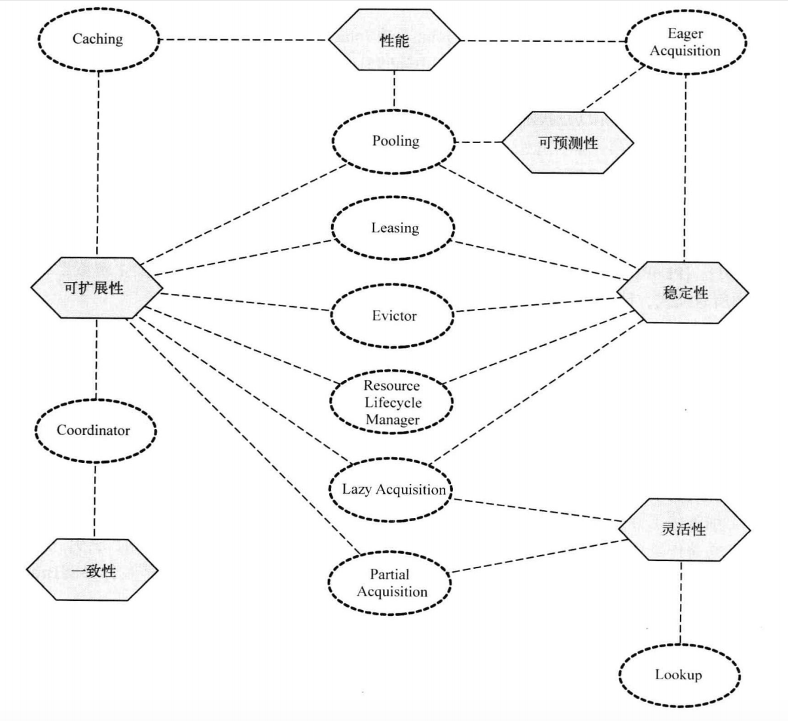
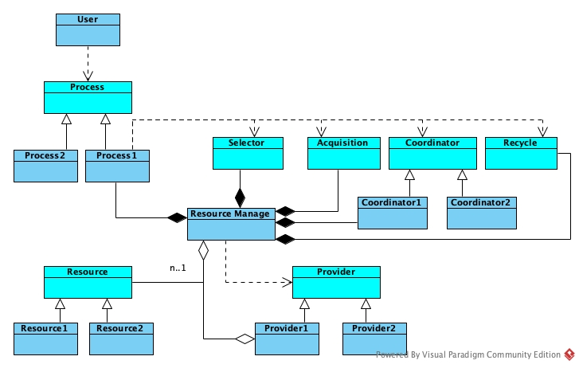

# 资源管理软件模式

自计算机诞生以来，跟资源的拉锯战一直是计算机科学的重点问题之一。在各种大型嵌入式系统中几乎无一例外的都会出现资源管理模块的名字。就是如此重要的软件模块类型，却经常性的疏于设计，通常都是积重难返的情况，才考虑重构。以下是几个常见的资源管理类软件的问题：

1. 资源多次申请释放操作后出现不一致的情况。
2. 资源获取或管理的性能不满足要求。
3. 新增资源类型或扩充资源总数需要大量的修改。

那是否有针对资源管理的架构模式能识别或解决这些问题呢？架构模式的提炼是相对困难的事情，随着高速迭代的开发节奏，更多人喜欢直接面向特定问题域的解决方案或思路，因此近些年尝试从业务领域中抽离，去总结模式概念的人少之又少。《面向模式的软件架构资源管理模式 卷3》作为少有的针对资源管理类的软件著作也已经绝版。虽然书中部分内容有些过时，但系统性确实值得称道。本文结合书中的知识和概念，以及在咨询中实践的一个资源管理类软件的重构，试图总结整理更符合现代资源管理软件的模式。

## 资源管理的解读

资源管理是资源用户对资源可用性进行控制的过程，很多非功能性需求都依赖有效的资源管理。资源管理之所以很难做好，正是由于缺少系统性的设计，往往是野蛮生长。由于资源对象的多样性，资源管理软件可能分布在各个不同的业务模块中，边界很容易被模糊化，以致于经常是在达到一定规模时，才显露出各方面的问题。先一起来看一下书中如何全面的解读资源管理

### 资源管理的关注点
相对于其他类型的软件模块，资源管理类软件普遍更受非功能性需求影响。资源管理软件需要在设计之初，了解自己能解决哪些方面的问题，常见的关注点主要体现在以下几个方面。

* 扩展性，资源类型上的扩展，资源总量上的扩展。
* 灵活性，资源管理过程易于配置，易于定制。
* 一致性，资源的申请释放，最终系统一致。
* 稳定性，长时间运行，保持稳定。
* 可预测性，行为是符合预期的，可验证的。
* 性能，访问的时延，吞吐量。

### 资源管理的角色：
在资源管理整个问题域中，共出现的4个角色，后续介绍的模式也是围绕着这几个角色之间进行阐述的。
* 资源分配者
* 资源使用者
* 资源管理软件（自己）
* 资源对象

### 资源管理模式解读：
书中提到了10个模式，是按照资源的生命周期的3个阶段来归类的，下面用自己的理解尝试简化表达
#### 资源获取
* Lookup：资源使用者通过资源管理软件选择资源管理分配者，避免资源使用者对资源提供者的实现产生依赖。
* Eager：资源管理软件作为代理，给资源使用者提供申请服务，资源管理软件根据资源申请的频率，提前从真实资源分配者那获取资源，提高申请效率。
* Lazy：资源使用者对资源的申请和使用并非同时进行，资源管理软件通过推迟部分资源的获取时机，获取良好的申请效率。
* Partial：资源管理软件负责串联一次资源申请的多个步骤，有点像lazy和eager的结合，但侧重点更放在过程的控制。相较于Coordinator，它每个阶段都会给资源使用者反馈，而Coordinator是全部成功再返回。
#### 资源生命周期管理
* Coordinator：资源管理软件针对资源使用者的一次性多个资源申请，进行事务性协调，以保证资源可以被完整的申请和回收。除了解决一致性的问题，有些算法本身就是需要根据各个资源的使用情况，来决定另一个资源的分配情况，这种算法的承载，也应该是Coordinator的职责。
* Caching：资源管理软件在资源用户完成资源使用时，缓存资源，并根据用户再次申请的标示，直接给用户提供缓存过的资源。
* Pooling：资源管理软件提供资源池，减缓与资源申请者的交互。与caching的差别主要是caching针对有标识符的，pooling针对无标识符
* Resource Lifecycle Manage：这个模式更像是其他很多模式的综合体，并不具有指导意义。
#### 资源释放
* Leasing：为资源的使用引入时间的约束，到时自动释放。
* Evisitor：根据算法标记资源，并根据回收策略对制定标记的资源进行回收。

从每个模式的介绍可以看出，每个模式都有自己的主要关注点，但并非每个模式都只解决一个方面的问题，详细的关系图如下：

### 基于解决问题的思考
回看文章开头的常见问题，基本上是关注点的子集，那也就是说可以采用上述的模式来解决，但很快我们就发现，怎么把这些问题和模式的应用揉在一起，好像无从下手。这像极了设计模式带给我们的感觉，仿佛有诸多武术招式，与人交手时，却不知道该怎么组合使用。下面本文继续尝试梳理针对资源管理的这个大问题域，该如何寻找架构模式

## 重新定义资源管理

首先，前文从生命周期的角度来描述的3个阶段，更偏向过程式设计。从大规模软件设计的趋势来看，以面向对象为基础的设计方法，更容易应对变化。因此我把阶段只作为对象的角色（role）来处理，那么资源管理应该承担是4个方面的职责，并把之前的模式重新归类：

* 资源选择：Lookup
* 资源获取：Eager，Lazy，Partial
* 资源管理：Coordinator，Caching，Pooling
* 资源归还：Leasing，Evisitor

其次，前文介绍的模式更多描述资源管理软件自身应该怎么做，其实资源的类型和资源提供者都有着变化的趋势，需要从架构层面考虑这两者的扩展性和组合性。

最后，资源的申请过程仍然存在一定的变化和组合，但这个变化和组合的调整，并不希望用户感知，因此引入对资源操作的过程控制接口来让用户接口更稳定。

前面介绍的资源管理模式，更像是局部实现模式选项，我理解的架构模式，应该提供给开发者一个最佳实践的框架，开发者可以通过架构模式知道这类型软件应该有哪些部分组成，以及这些部分怎么交互。从而在设计时可以以这个框架为基础，在框架内进行局部的选择和设计。针对资源管理软件，我理解应该是如下图的模式：

这样的架构模式将可以从以下4个方面来应对变化。
* Resource接口来应对资源种类的变化
* Provider接口来应对资源提供方的来源变化
* 每个阶段都有一个对应接口，这些接口来承载具体算法的变化
* Process用来基于阶段的接口编程，编排资源申请的一些流程。

### 资源管理的问题是否解决
* 一致性问题：通过Coordinator来解决申请过程的一致，Recycle可以选择合适的算法来解决最终一致性问题。
* 性能问题：根据具体的性能需求，在4个方面考虑选择对应的模式和算法。
* 扩展性问题：新增资源可以通过`resource`来扩展，容量扩展可以通过`provider`来扩展，过程的重新编排可以通过`process`来扩展

## 资源管理软件过程设计

针对资源管理类的软件，即便掌握了架构模式，还是要遵循一定的套路开展设计过程，以避免一上来就直奔解决方案的选择，走入欠考虑和过度设计的泥潭。

### 如何设计
1. **确定关键资源**：不同资源类型的分配方式，扩展方式都影响到接口的设计。
2. **确定问题背景**：在什么样的大背景之下，提供怎样的资源分配情况，
3. **从不同关注点设计**：选择适合问题背景的各个阶段的分配算法。根据资源管理对象的设计，驱动出对资源对象和资源分配者的接口需求，再根据用户和资源的情况，组合对资源算法接口的访问过程。
4. **综合评估**：阶段最优并非全局最优，repeat 3-4 重新梳理阶段的关注点，选择合适的模式，最终看是否解决了问题。

### 某媒体面资源管理重构案例

#### 确定关键资源
该项目软件是负责分配通道ID和逻辑cycle数，有很多种不同类型的资源，有的类型是有标示的，如分配ID，有些资源是无标示的，如分配逻辑cycle数。所有资源都是可重用的资源。

#### 确定问题背景
cycle数和通道ID的分配范围是针对底层的硬件的多个实例抽象来的，因此资源不应该是单一的分配者。

重构前，软件面临的主要问题是一致性的问题，以及资源类型的扩展导致的散弹式修改。

#### 从不同的关注点设计

##### 资源管理阶段设计：
  1. 查找分配者阶段：LookUp模式选择最少占用的资源分配者。
  2. 分配阶段：只针对会议场景的诉求采用来Eager模式，做资源预留，
  3. 分配过程：针对事务一致性采用Coordinator，收集多个资源类的资源占用，一次性占用或失败，避免回退。
  4. 归还阶段：由于没有性能问题，和问题需求，采用直接归还的方式。
  
##### 资源分配者设计：
由于资源分配者因对问题域的多线程资源分配，Lookup模式要求资源分配者提供`rest_resource`，以及`register`接口，

##### 资源对象设计：
资源对象的分配阶段采用Coordinator模式，因此对资源对象的接口诉求就是需要提供`pre_occupy`,`commit`,`rollback`等操作，新增类型都需要实现上述接口。

##### 资源过程设计：
针对资源分配流程，本案例是通过异步交互的方式，针对不同的资源，交互过程也有差异，因此在分配过程设计中采用了简单的异步消息事务管理机制。

#### 综合评估反馈。
由于本案例并不涉及性能的评估，因此不涉及性能的测试和调整。仅针对重构前的问题进行分析，资源不一致的问题引入Coordinator模式后，所有资源操作均统一到一处的申请过程到代码，不同资源都遵循相同接口，很难再出现不一致的问题；新增资源类型和扩展资源总数都是在基于接口的实现中，接口的调用方均不需要作出调整，真正做到开闭原则。

## 总结
通过资源管理架构模式的总结，可以看出资源管理软件架构模式可以在一定层面上预判和消解一些问题的方面，为资源管理软件打造良好的开局。但它不能代替后续详细的设计过程，架构模式也并非一成不变，不可裁剪的，还是要针对业务的问题域与约束，谨慎的实践，才能得到“刚刚好”的设计，同时也要提醒大家，保持演进才是软件生命力延续的根本，“一锤定音”不是。

